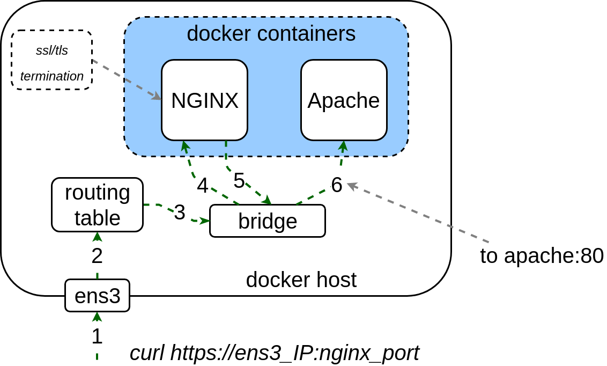

# Task 10.12.2 — NGINX Reverse Proxy & Apache in Docker

## Overview

A bash script that installs Docker CE, generates a self-signed TLS certificate chain, and launches an NGINX reverse-proxy container in front of an Apache2 container using Docker Compose. NGINX terminates HTTPS and forwards plaintext HTTP traffic to Apache. All configurable parameters (host IP, hostname, port, image names, log directory) are read from a single `config` file.



---

## Script

### `task10_12_2.sh`

- Reads all runtime parameters from `./config` in the same directory as the script
- Creates directories `certs/`, `etc/`, and `$NGINX_LOG_DIR` if they do not exist
- Installs **Docker CE** from the official Docker apt repository
- Installs **docker-compose** v1.21.2 from the official GitHub release binary
- Generates a **root CA** key and self-signed certificate (`certs/root.key`, `certs/root.crt`)
- Generates an **NGINX server certificate** signed by the root CA (`certs/web.key`, `certs/web.crt`) with SubjectAltNames containing the Docker host's IP address and hostname from `config`
- Appends the root CA to `certs/web.crt` to form a complete certificate chain
- Writes `etc/nginx.conf` — an SSL server block that proxies all requests to the `apache` container
- Writes `docker-compose.yml` — launches `nginx:1.13` and `httpd:2.4` on a shared default network; mounts the config, certificates, and log directory into the nginx container
- Brings both containers up with `docker-compose up -d`

---

## Configuration

The `config` file is sourced by the script and defines all tuneable parameters:

```bash
# Host parameters
EXTERNAL_IP=10.157.1.14
HOST_NAME=docker-vm.dlnet.kharkov.com

# Docker parameters
NGINX_IMAGE="nginx:1.13"
APACHE_IMAGE="httpd:2.4"
NGINX_PORT=445
NGINX_LOG_DIR=/srv/log/nginx
```

| Parameter | Description |
| --- | --- |
| `EXTERNAL_IP` | IP address of the Docker host; added to the certificate SAN and `/etc/hosts` |
| `HOST_NAME` | FQDN of the Docker host; added to the certificate SAN and `/etc/hosts` |
| `NGINX_IMAGE` | Docker image for the NGINX container (must be `nginx:1.13`) |
| `APACHE_IMAGE` | Docker image for the Apache container (must be `httpd:2.4`) |
| `NGINX_PORT` | Host port that NGINX listens on for HTTPS traffic |
| `NGINX_LOG_DIR` | Absolute path on the host where NGINX access/error logs are written |

---

## Required File Structure

After `task10_12_2.sh` completes successfully the following layout must be present in the repository directory:

```
WORKDIR
├── certs
│   ├── root.crt          # root CA certificate (used to verify the HTTPS connection)
│   ├── web.crt           # NGINX certificate (chain: server cert + root CA)
│   └── web.key           # NGINX private key
├── config                # parameters file
├── docker-compose.yml    # generated by the script
├── etc
│   └── nginx.conf        # generated by the script
└── task10_12_2.sh        # entry point
```

---

## Environment Setup Guide

The grader runs the script on a **freshly installed Ubuntu 16.04 (Xenial) VM** as `root` with internet access. Replicate this environment locally to test before submission.

### Option A — Vagrant (recommended)

**Prerequisites:** [VirtualBox](https://www.virtualbox.org/) and [Vagrant](https://www.vagrantup.com/) installed.

Create a `Vagrantfile` in any working directory:

```ruby
Vagrant.configure("2") do |config|
  config.vm.box = "ubuntu/xenial64"
  config.vm.network "forwarded_port", guest: 445, host: 445
  config.vm.provider "virtualbox" do |vb|
    vb.memory = "1024"
  end
end
```

```bash
# Start the VM and open a root shell
vagrant up
vagrant ssh
sudo -i

# Clone the repository
git clone https://github.com/<your-username>/task10_12_2 /root/task10_12_2
cd /root/task10_12_2

# Set HOST_NAME and EXTERNAL_IP in config to match the VM's address, then run:
bash task10_12_2.sh
```

To verify from the host machine (after port forwarding is set up):

```bash
# Copy certs/root.crt out of the VM first:
vagrant scp default:/root/task10_12_2/certs/root.crt ./root.crt

curl --cacert root.crt --resolve docker-vm.dlnet.kharkov.com:445:127.0.0.1 \
     https://docker-vm.dlnet.kharkov.com:445
```

To re-use the VM later:

```bash
vagrant halt
vagrant up
vagrant ssh
```

To start fresh:

```bash
vagrant destroy -f
vagrant up
```

---

### Option B — Multipass (lightweight, works on Windows / macOS / Linux)

**Prerequisites:** [Multipass](https://multipass.run/) installed.

```bash
# Launch a Ubuntu 16.04 instance
multipass launch xenial --name nginx-test --mem 1G

# Open a shell
multipass shell nginx-test
```

Inside the instance:

```bash
sudo -i
apt-get install -y git
git clone https://github.com/<your-username>/task10_12_2 /root/task10_12_2
cd /root/task10_12_2
bash task10_12_2.sh
```

---

### Manual Test Sequence

Run these commands inside the VM/instance after `task10_12_2.sh` completes:

```bash
# 1. Confirm both containers are running
docker-compose ps

# 2. Send a test HTTPS request using the generated root CA
source ./config
curl --cacert certs/root.crt https://${HOST_NAME}:${NGINX_PORT}
# Expected: response body contains "It works!"

# 3. Confirm the access log was written to the host
cat ${NGINX_LOG_DIR}/access.log

# 4. Check certificate SAN fields
openssl x509 -in certs/web.crt -text -noout | grep -A4 "Subject Alternative Name"
# Expected: IP:$EXTERNAL_IP and DNS:$HOST_NAME
```

---

## Verification Checklist

| Check | Command | Expected result |
| --- | --- | --- |
| Both containers running | `docker-compose ps` | `nginx` and `apache` show `Up` |
| HTTPS returns Apache page | `curl --cacert certs/root.crt https://$HOST_NAME:$NGINX_PORT` | Body contains `It works!` |
| `certs/root.crt` present | `ls certs/root.crt` | File exists |
| `certs/web.crt` present | `ls certs/web.crt` | File exists |
| `certs/web.key` present | `ls certs/web.key` | File exists |
| `etc/nginx.conf` present | `ls etc/nginx.conf` | File exists |
| `docker-compose.yml` present | `ls docker-compose.yml` | File exists |
| NGINX image is `nginx:1.13` | `docker inspect <nginx-container> \| grep '"Image"'` | `nginx:1.13` |
| Apache image is `httpd:2.4` | `docker inspect <apache-container> \| grep '"Image"'` | `httpd:2.4` |
| Certificate SAN contains host IP | `openssl x509 -in certs/web.crt -text -noout \| grep IP` | Shows `$EXTERNAL_IP` |
| Certificate SAN contains hostname | `openssl x509 -in certs/web.crt -text -noout \| grep DNS` | Shows `$HOST_NAME` |
| NGINX logs written to host | `cat $NGINX_LOG_DIR/access.log` | Contains at least one log entry |

---

## Verification Procedure

### Environment

- **OS:** Ubuntu Xenial 16.04 Server (`xenial-server-cloudimg-amd64-disk1.img`)
- **User:** `root`
- **Network:** internet access available
- **Pre-installed packages:** only what ships with the base image

### Execution Rules

- The repository is cloned by URL (repository must be named `task10_12_2`); a different name causes automatic failure.
- `task10_12_2.sh` is executed from the repository root; a different script name or subdirectory location causes automatic failure.

### What Is Checked

1. **HTTPS connectivity** — an HTTPS `GET` request is made to the Docker host on `$NGINX_PORT` using `certs/root.crt` as the trusted CA. The response must contain the default Apache2 page (`It works!`).
2. **Container presence** — two containers must be running with base images `nginx:1.13` and `httpd:2.4`.
3. **Volume mounts** — the nginx container must have `etc/nginx.conf`, the `certs/` directory, and `$NGINX_LOG_DIR` mounted.
4. **Access log** — at least one entry must exist in `$NGINX_LOG_DIR/access.log` on the host after the HTTPS request.
5. **File structure** — `docker-compose.yml`, `etc/nginx.conf`, and the `certs/` directory must all be present in the project directory.

### General Assignment Rules

1. The completed assignment must be in a separate repository on github.com (e.g. `https://github.com/user/task10_12_2`).
2. A freshly installed VM from `xenial-server-cloudimg-amd64-disk1.img` is used for verification.
3. Any additional packages beyond those in the image may be installed; installation must be handled by the script.
4. Scripts are executed as `root`.
5. The assignment must be submitted by **23:59 on 13/05/18**.
